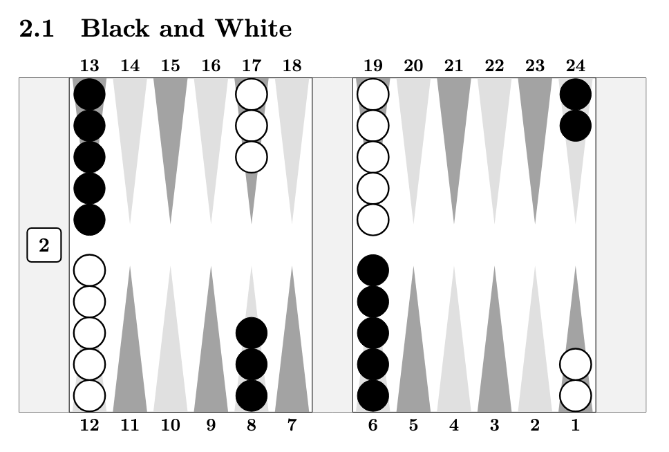

# LaTeX Backgammon

A package for drawing backgammon vector diagrams with LaTeX.

## References

- Other LaTeX backgammon projects:
  - [@amunn/tikz-backgammon](https://github.com/amunn/tikz-backgammon)
  - [CTAN - bg](https://ctan.org/pkg/bg)
  - [TeX Stack Exchange - Typesetting boardgame positions using ttf font](https://tex.stackexchange.com/questions/48591/typesetting-boardgame-positions-using-ttf-font)
- Repos:
  - [@psygo/latex_shogi](https://github.com/psygo/latex_shogi)
  - [@psygo/latex-go-diagrams-template](https://github.com/psygo/latex-go-diagrams-template)
  - [@FanaroEngineering/traducao_como_jogar_go](https://github.com/FanaroEngineering/traducao_como_jogar_go)
  - [@psygo/tecnicas_de_go](https://github.com/psygo/tecnicas_de_go)
  - [@psygo/tsumego_workbooks](https://github.com/psygo/tsumego_workbooks)
- TeX Stack Exchange:
  - [Japanese Artsy Cursive Fonts for Shogi](https://tex.stackexchange.com/q/730168/64441)
- Useful Software:
  - [Inkscape](https://inkscape.org/)
